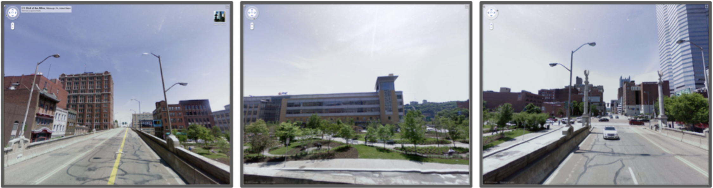
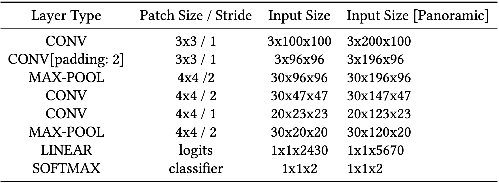
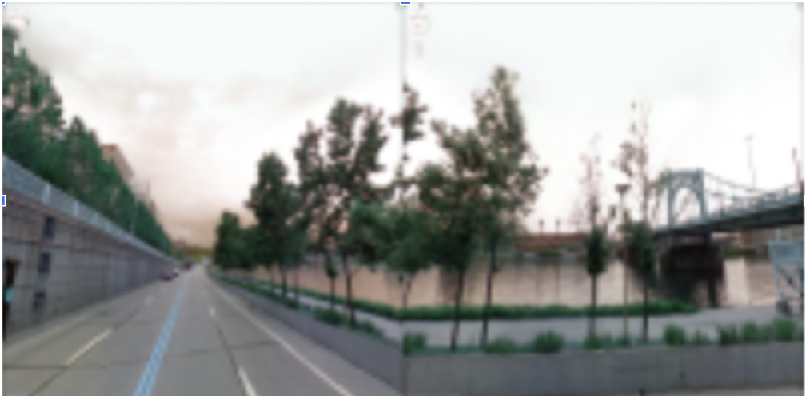
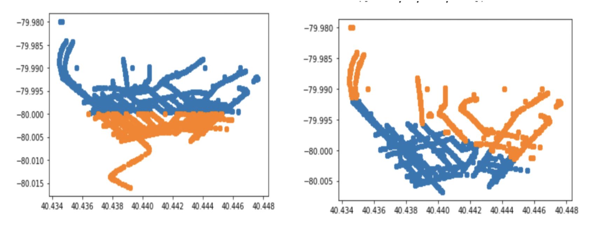
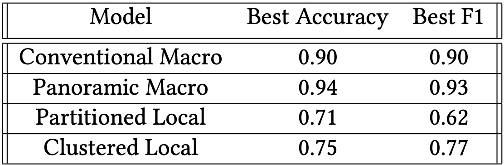
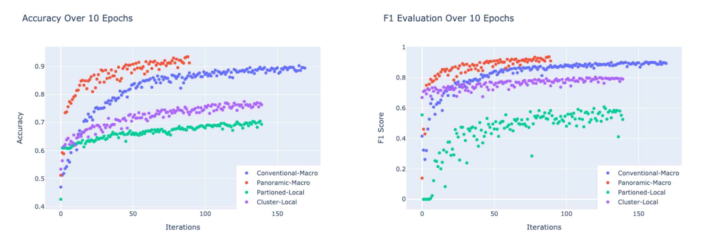
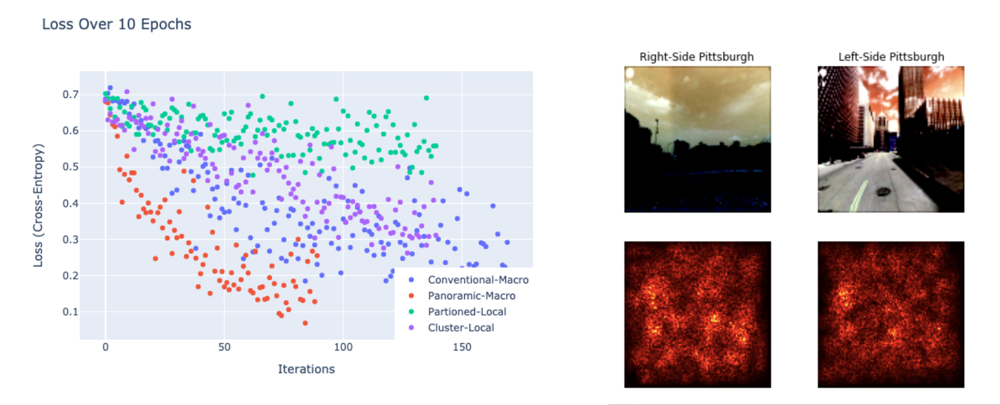
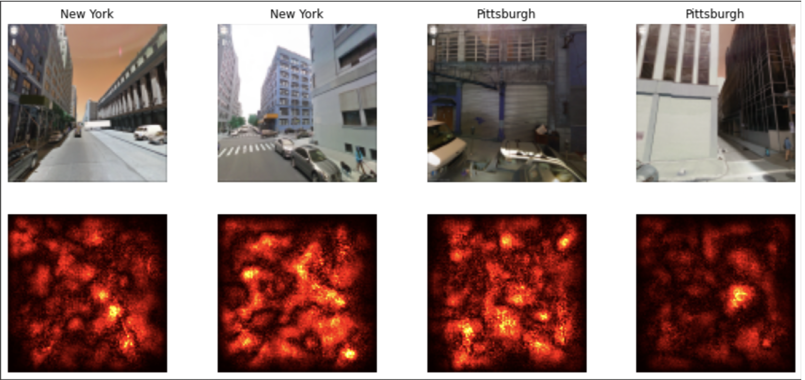

# Visual Geolocation: Approaches, Challenges, and Insights

### STEPHEN SCARANO, University of Massachusetts, Amherst, USA


I explore multiple approaches to the problem of Visual Geolocation applied to Google Street View data of Pittsburgh, PA and Orlando, FL. I propose two approaches unique to this setting which I call *Panoramic Macro-Classification* and *Clustered Local-Classification* which both demonstrate significant improvement to model performance, the latter of which necessitates negligible computational cost. The trained model itself demonstrates attention to characteristic structures: building textures, skylines, cars, but also human agents. Additional Key Words and Phrases: neural networks, convolutional neural networks, geolocation.

### 1. INTRODUCTION

I define *Visual Geolocation* as the identification or approximation of a geographic position based on
visual information. Previous research [4 , 6] from which this paper is inspired coins the similar term
*Photo Geolocation*; however, it is my feeling that this language limits the scope of our shared problem.
Indeed, much of this paper concerns itself with panoramas fixed in space (i.e multiple-perspective
images fixed at a single point), and thus our approach may do well to consider more than atomized
image inputs.
Instead, I subdivide the problem of Visual Geolocation into two approachable tasks:

I. **Macro-Identification**: Provided information from one or more foreign, distinguished locations,
classify the location of a new instance.

II. **Local-Identification**: Provided informationwithina particular geographic boundary, estimate
a new instance’s relative location.

Note that this framing is a largely practical construction: in many ways these problems are re-
wordings of one another; yet, eachsuggestsa different approach with a different goal. For instance,
Macro-Identification is easily interpreted as a classification problem and Local-Identification might
lend itself to coordinate regression. It is my goal in this paper to compare, contrast, and introduce
foundational approaches to the Macro and Local Identification problems using a basic convolutional
neural network (CNN) architecture. These approaches are outlined below:

1. *Conventional Macro-Classification*: Likely the most intuitive approach to Macro-Identification. By labeling singular images by city, we train our CNN in a classification setting.
2. *Panoramic Macro-Classification*: Structurally the same approach as above; but here we append two images at the same point width-wise together, essentially forming a panorama
at that point.
3. *Local-Regression*: Likely the most intuitive approach to Local-Identification. By tagging each image by its coordinates, we train our CNN in a regression setting.
4. *Partitioned Local-Classification*: By partitioning the city-space, we label each image by its side of the dividing line, transforming Local-Identification into a classification problem.
5. *Clustered Local-Classification*: Similar to the above approach, we instead label each image with respect to a K-means clustering of the training instances.

### 2. RELATED WORK
Early work in Photo Geolocation compared query images (or relevant computed features of query images) to those of an accompanying dataset, where the breadth of the problem was in developing successful distance functions [1,7]. While promising, these methods necessitate the continuous maintenance of comparison datasets, and the Nearest-Neighbor approach itself suffers from significant computational burden during test-time. It is for these reasons—alongside significant performance improvements—that convolutional neural networks have proved promising tools in visual geolocation tasks.

_PlaNET_ was the first global-scale CNN developed which surpassed the state of the art benchmarks previously held by IM2GPS, a comparatively complex Nearest-Neighbors model. Its inventors divided the world map into a number of disjoint cells, spanning most of the world’s surface, and labeled training images accordingly to establish a classification setting [6]. There are a number of advantages to this: First, performing regression on coordinates widens the solution space, particularly troublesome since not all coordinate positions are represented (nor should they since not all positions may be relevant). Second, a classification context enables anadjustable degree of granularityto our predictions; by increasing or decreasing the number of partitions in a space, we essentially scale the ambition of our predictions.

Following success, researchers expanded upon _PlaNET_ by incorporating apriori knowledge; specifically, extracting thescene contentof the image (i.e indoors, outdoors, urban, natural, etc.) to consider before classification—thus learning unique features for each class [4]. Despite their differences, however, both _PlaNET_ and its hierarchical successor are built on top of Google’s _Inception_ architecture [4,6]. _Inception_ was built as a workaround to the depth-parameter trade-off common to neural networks: by increasing the depth and width of a network, we can improve performance but only at heightened computational stress and risk of over-fitting. The authors identify theInception nodeas its central innovation; it works, mainly, by allowing a network to weight different filter sizes during training by concatenating the feature outputs of multiple kernel sizes, largely escaping explosive computational overhead [5].


```
Fig. 1. Three perspective images from the same point in the dataset
```


```
Table 1. Architecture of Conventional CNN
```

### 3. APPROACH

I intend to evaluate differing visual geolocation approaches by comparative analysis. Each of the trials (Conventional Macro-Classification (CMC), Panoramic Macro-Classification (PMC), Local-Regression (LR), Partitioned Local-Classification (PLC), and Clustered Local-Classification (CLC)) described in further detail below are applied to a publicly available Google Street-View dataset provided by the _Center for Research in Computer Vision_[7]. The set of nearly 63,000 images contains roughly 13,000 points in space which each correspond to 5 perspective images; which together comprise a 360◦ view (excluding downward) from each spot. The placemarks are split relatively evenly between Pittsburgh, PA, Orlando, FL, and downtown Manhattan, NY, with a slight bias in favor of the former two cities. In addition, we execute these approaches utilizing an identical CNN architecture as described in Table 1; however, particular approaches necessitate slight accommodations: For instance, local regression follows its _Linear_ layer with an _L1_ Loss function in place of _Softmax_, and Panoramic Macro-Classification takes input dimensions of double the conventional width. All of these changes will be listed in detail in the Experiment section below. Instead, this section lists my intuitions for each approach.


#### 3.1. Conventional Macro-Classification
Conventional Macro-Classification intends to discriminate between two or more distinct areas of interest—in the case of the following experiments, Orlando and Pittsburgh. This approach benefits from both a simple solution space (two classes) and, potentially, the clearest inputs to classify. Distinct locations share distinct histories, often translating into divergent skylines and architectural trends, but we must also be keen to less impressive features of interest as well: differing climates may translate into differing levels of sunlight which to our model may be an easy tell. If our interest is to separate locations by natural or architectural detail as in previous research, we must be careful to considerallpossible divergences between the input pixel values [2].


#### 3.2. Panoramic Macro-Classification
Panoramic Macro-Classification builds upon CMC with additional benefits and drawbacks. By appending two or more perspectives from the same point, we essentially provide our model a "human view" at that point in space. In real terms, we increase the descriptive potential of each instance—at the cost of the training set size; yet even dismissing the increase to the feature-space, appending images may aid to combatdud imageswhich provide very little information (say, the side of a wall). One potential work-around to the halved training set size could be a reverse-appending of each instance.


```
Fig. 2. Example of a PMC instance appending two perspectives from the same image 
```

#### 3.3. Local Regression
In Local Regression, we perform regression on the image’s point-coordinates. Research on visual geolocation is largely absent of regression problems, at least as far as neural network solutions go. My general intuitions for this are listed in the Related Works section, and I include it here primarily as a trial to contrast against other approaches.

#### 3.4. Partitioned Local-Classification
Partitioned Local-Classification is the contemporary go-to workaround to the constraints of Local Regression. By dividing the coordinate-map of a space into discrete cells (essentially overlaying a grid), we appropriate the benefits of traditional classification without the drawbacks of a regression problem. On the downside, we might expect (depending upon our partitions) a model to struggle with the arbitrary cell dividing lines, particularly on a local scale.


```
Fig. 3. Pittsburgh data instances partitioned by arbitrary boundary (left) vs. clustered grouping (right). The clustering appears to naturally group points into city outskirts and the city center.
```

#### 3.5 Clustered Local-Classification
I believe Clustered Local-Classification is my largest contribution to the visual geolocation field, sharpening the rough edges of the PLC approach. Rather than choosing an arbitrary set of gridlines to divide up a local area, we instead take inspiration from the R-CNN architecture, proposing potential division lines with apriori information [3]. While the potential applications are vast, the scope of this paper will concern a K-Means clustering of points by coordinate distance. I hope to demonstrate that these "natural" division lines lay a firmer groundwork for classification.



```
Table 2. Best Model Accuracy and F1 Evaluation over 10 Epochs
```

### 4. EXPERIMENTATION

As suggested above, each problem approach will be evaluated using essentially the same CNN architecture applied to the CVRC Google Street map dataset. The specifics of each trial’s methodology are described below. Note that due to hardware limitations, all instances have been scaled down to more laptop-friendly 100x100 images.


#### 4.1. Conventional and Panoramic Macro-Classification

As a result of hardware limitations, I extract an 11,000 image subset containing an equal mix of Pittsburgh and Orlando instances. Each instance is labeled accordingly, and the model is trained using the architecture shown in Table 1. Panoramic Classification follows nearly the same methodology, except for every point in space (where each point corresponds to 5 images total), we append two images width-wise together, producing a new image of size 3x200x100. These new modified training images are then used to train a near-identical model with slight dimension accommodations listed in the rightmost column. Training will continue over 10 Epochs, and the best model is selected and assessed in the _Results_ section below.

#### 4.2. Local Regression
Local Regression discards labels in favor of training directly on the coordinates themselves. A 11, Pittsburgh-image sample is trained on using the _L1 loss_ function, yet apart from these changes, the architecture and methodology remain the same. Training will continue over 10 Epochs, and the best model is selected and assessed in the Results section below.


#### 4.3. Partitioned and Clustered Local-Classification
Partitioned and Clustered Local-Classification will utilize an identical model to that of Conventional Classification; however, applied to the 11,000 sample of Pittsburgh images. In the case of the former, a line will be drawn vertically such that Pittsburgh images to its east will be labeled differently than their neighbors to the west of it. In the case of the latter, we label points only after performing K-Means clustering and evaluating their distance to each centroid, i.e, images in Cluster A will be labeled differently than those in Cluster B. Training will continue over 10 Epochs, and the best model is selected and assessed in the Results section below.

#### 4.4. Results


```
Fig. 4. Accuracy and F1 Evaluation for Macro and Local Classification models
```

Training evaluation metrics have been tracked by epoch for each classification model (see figure 4) and the best of each is listed in Table 2. Conventional and Panoramic Macro-Classification unsurprisingly outperform all other models; however, it is interesting that the latter both converges faster than and exceeds the former with half the training set size. Unfortunately, this expansion in the feature space came at the cost of added computational burden, and to avoid scaling down the images I migrated the code to Google’s _Colab Pro_ service. Clustered Local Classification consistently outperforms Partitioned Classification by about 4-5%, with negligible computational overhead. Local Regression was largely (and expectedly) a failure: after 10 epochs, the best model predicted coordinate locations with an average L1 error of 0.4◦ which is less impressive than it sounds considering that 0.4◦ spans the entire city of Pittsburgh.


```
Fig. 5. Model loss (left) alongside example saliency map (right) – the latter [Partition Classification] appears
to take interest in building texture and skylines
```

A saliency map analysis (example in Figure 5) demonstrates that the local-partition model appears moderately attracted to characteristic structures (i.e skylines, building texture, etc.), though the visual relationship is not overwhelming. More strongly, the model favors human and car elements – suggesting that partitions based on demographic attributes (wealth, ethnicity) may better characterize local geography than architecture. This may suggest that although architectural identity is indeed quite relevant to the trained classification model, so too is the background noise of pixel brightness and general hue.



```
Fig. 6. Saliency map of Conventional Macro-Classification. The model appears to take interest in both humans
and cars.
```

### 5. CONCLUSION

I hoped to demonstrate that our approach to a deep learning problem is as critical to success as the architecture itself—that it is as necessary to ask the question of "In what ways can I solve the problem" as "In what ways can I alter the problem". If identifying an image in one ofnpartitioned cells is the stated goal, it seems unimaginative to overlay an arbitrary boundary when an comparatively learnable one is available. In this paper, the scope of the problem is limited, but we may imagine learned partitions clustered over many potential features of interest (year founded, resident demographics, etc.) such that the application of a CNN is optimal. Compared to a Panoramic feature-extending approach the computational cost is minimal, and its performance benefit is significant. I would like to see (and perform) research which explores this road. Additionally, much of the work done in this paper is done at a small scale utilizing a generic CNN model, yet I’d be curious to analyze the evaluation metrics done on more contemporary architectures; particularly the Inceptio nmodel comes to mind as the visual geolocation problem stands to benefit from a spatially dynamic architecture.


#### 5.1. Ethical Implications

Partly in reaction to recent breakthroughs in neural network research—journalists, academics, and computer scientists continue to voice concern regarding the ongoing deployment of advanced computer vision products. Whether in the hands of stalkers, federal intelligence, or local law enforcement, these technologies have the potential to locate citizens automatically, and as such their use must be vetted by those same citizens.

### ACKNOWLEDGMENTS

To Connor O’Brien, who picked up takeout while I worked on this.


### REFERENCES

[1] Jan Brejcha and Martin Cadik. 2017. State-of-the-art in visual geo-localization.Pattern Analysis and Applications20 (
2017). https://doi.org/10.1007/s10044-017-0611-

[2] Carl Doersch, Saurabh Singh, Abhinav Gupta, Josef Sivic, and Alexei A. Efros. 2012. What Makes Paris Look like Paris?
ACM Trans. Graph.31, 4, Article 101 (jul 2012), 9 pages. https://doi.org/10.1145/2185520.

[3] Ross B. Girshick, Jeff Donahue, Trevor Darrell, and Jitendra Malik. 2013. Rich feature hierarchies for accurate object
detection and semantic segmentation.CoRRabs/1311.2524 (2013). arXiv:1311.2524 [http://arxiv.org/abs/1311.](http://arxiv.org/abs/1311.)

[4] Eric Müller-Budack, Kader Pustu-Iren, and Ralph Ewerth. 2018. Geolocation Estimation of Photos using a Hierarchical
Model and Scene Classification.

[5] Christian Szegedy, Wei Liu, Yangqing Jia, Pierre Sermanet, Scott E. Reed, Dragomir Anguelov, Dumitru Erhan, Vincent
Vanhoucke, and Andrew Rabinovich. 2014. Going Deeper with Convolutions.CoRRabs/1409.4842 (2014). arXiv:1409.
[http://arxiv.org/abs/1409.](http://arxiv.org/abs/1409.)

[6] Tobias Weyand, Ilya Kostrikov, and James Philbin. 2016. PlaNet - Photo Geolocation with Convolutional Neural
Networks.CoRRabs/1602.05314 (2016). arXiv:1602.05314 [http://arxiv.org/abs/1602.](http://arxiv.org/abs/1602.)

[7] Amir Roshan Zamir and Mubarak Shah. 2014. Image Geo-Localization Based on MultipleNearest Neighbor Feature
Matching UsingGeneralized Graphs. IEEE Transactions on Pattern Analysis and Machine Intelligence36, 8 (2014),
1546–1558. https://doi.org/10.1109/TPAMI.2014.


